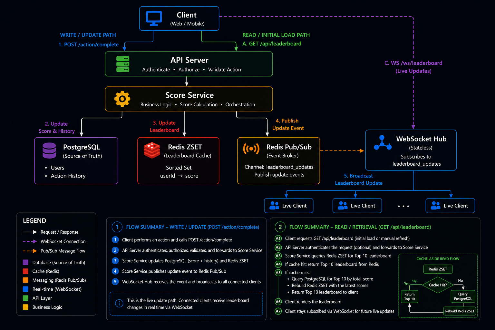

# Scoreboard Module Specification

## Overview

This module is responsible for maintaining and broadcasting a live scoreboard displaying the top 10 users by score.

The system allows authenticated users to perform actions that increase their score. Upon successful completion of an action, the user's score is updated and the leaderboard is refreshed in real time.

The module must prevent unauthorized score manipulation and support live leaderboard updates for connected clients.

---

# Functional Requirements

## Requirements

1. Display the top 10 users by score.
2. Support real-time leaderboard updates.
3. Allow users to perform actions that increase their score.
4. Process score updates through an API endpoint.
5. Prevent unauthorized score modification.

---

# High-Level Architecture



---

# Components

## API Layer

Responsible for:

- Authentication
- Authorization
- Request validation
- Rate limiting

Endpoints:

### Complete Action

POST /api/actions/complete

Request:

```json
{
  "actionId": "daily_login"
}
```

Response:

```json
{
  "success": true,
  "newScore": 150
}
```

### Get Leaderboard

GET /api/leaderboard

Response:

```json
{
  "leaders": [
    {
      "userId": "123",
      "score": 1500
    }
  ]
}
```

### Live Leaderboard Updates

GET /ws/leaderboard

Description:

Provides real-time leaderboard updates to connected clients.

Example Event:

```json
{
  "type": "leaderboard_updated",
  "leaders": [
    {
      "userId": "2",
      "score": 1500
    },
    {
      "userId": "1",
      "score": 1200
    },
    ...
  ]
}
```

---

## Score Service

Responsible for:

- Validating actions
- Calculating score increments
- Updating persistent storage
- Updating leaderboard cache
- Publishing leaderboard events

The service must not trust score values provided by clients.

The server determines all score changes.

Example:

Valid:

```json
{
  "actionId": "daily_login"
}
```

Invalid:

```json
{
  "scoreIncrease": 1000000
}
```

---

## Database

### Users

| Column | Type |
|----------|----------|
| id | UUID |
| username | VARCHAR |
| total_score | INTEGER |

### Action History

| Column | Type |
|----------|----------|
| id | UUID |
| user_id | UUID |
| action_id | VARCHAR |
| score_awarded | INTEGER |
| created_at | TIMESTAMP |

Purpose:

- Audit trail
- Fraud investigation
- Score reconstruction
- Analytics

---

## Redis Leaderboard

Redis is used as a high-performance cache for leaderboard operations.

Data Structure:

```
leaderboard
```

Type:

```
Sorted Set (ZSET)
```

Example:

```
user:1 -> 1200
user:2 -> 950
user:3 -> 700
```

Operations:

Update score:

```redis
ZADD leaderboard 1200 user:1
```

Retrieve top 10:

```redis
ZREVRANGE leaderboard 0 9 WITHSCORES
```

---

# Score Update Flow

1. User completes an action.
2. Client calls POST /api/actions/complete.
3. Authentication middleware validates identity.
4. Authorization verifies permission.
5. Score Service validates action.
6. Database transaction updates score.
7. Action history is recorded.
8. Redis leaderboard is updated.
9. Leaderboard update event is published.
10. Connected clients receive live updates through WebSocket.

---

# Live Update Flow

1. Client establishes WebSocket connection.
2. Client subscribes to leaderboard updates.
3. Score updates trigger leaderboard events.
4. WebSocket Gateway broadcasts updated leaderboard.
5. Clients update UI without page refresh.

---

# Client Initialization Flow

1. Client requests the current leaderboard `GET /api/leaderboard`
2. The current leaderboard is displayed
2. Client establishes a WebSocket connection: `GET /ws/leaderboard`
3. Future leaderboard updates are delivered through WebSocket events

---

# Security Considerations

## Authentication

All score-related endpoints require authenticated users.

Supported mechanisms:

- JWT
- Session-based authentication
- OAuth2

---

## Authorization

Users may only perform actions on their own accounts.

Administrative actions require elevated permissions.

---

## Action Validation

The server validates:

- Action existence
- Action eligibility
- Action completion rules

Score values must never be supplied by clients.

---

## Rate Limiting

Apply rate limiting to prevent abuse.

Suggested implementation:

- Redis-based rate limiter
- Per-user limits
- Per-IP limits

---

## Idempotency

Duplicate requests must not generate duplicate scores.

Recommendation:

Store a unique action execution identifier.

Example:

```json
{
  "actionExecutionId": "abc-123",
  "actionId": "daily_login"
}
```

Previously processed identifiers should be rejected.

---

# Error Handling

Common responses:

401 Unauthorized

```json
{
  "error": "Authentication required"
}
```

403 Forbidden

```json
{
  "error": "Action not allowed"
}
```

409 Conflict

```json
{
  "error": "Action already processed"
}
```

429 Too Many Requests

```json
{
  "error": "Rate limit exceeded"
}
```

---

# Recovery Strategy

Redis is treated as a cache rather than the system of record

PostgreSQL remains the source of truth for all score data

In the event of Redis data loss or restart:

1. Rebuild the leaderboard from PostgreSQL
2. Repopulate the Redis sorted set
3. Resume normal operation

This ensures leaderboard recovery without data loss

---

# Scalability Considerations

The architecture should support horizontal scaling.

API servers should remain stateless.

Leaderboard state should reside in Redis.

WebSocket connections may be distributed across multiple gateway instances.

For larger scale deployments, Redis Pub/Sub may be replaced by a dedicated message broker such as:

- Kafka
- RabbitMQ

---

# Monitoring

Track:

- Score update throughput
- Leaderboard retrieval latency
- Redis latency
- WebSocket connection count
- Failed authentication attempts
- Fraud detection metrics

---

# Future Improvements

1. Event-driven architecture using Kafka.
2. Dedicated Leaderboard Service.
3. Fraud detection and anomaly analysis.
4. Regional leaderboard support.
5. Historical leaderboard snapshots.
6. Multi-category leaderboards.
7. Optimization to store only the Top N users required for leaderboard display when user volume becomes extremely large
